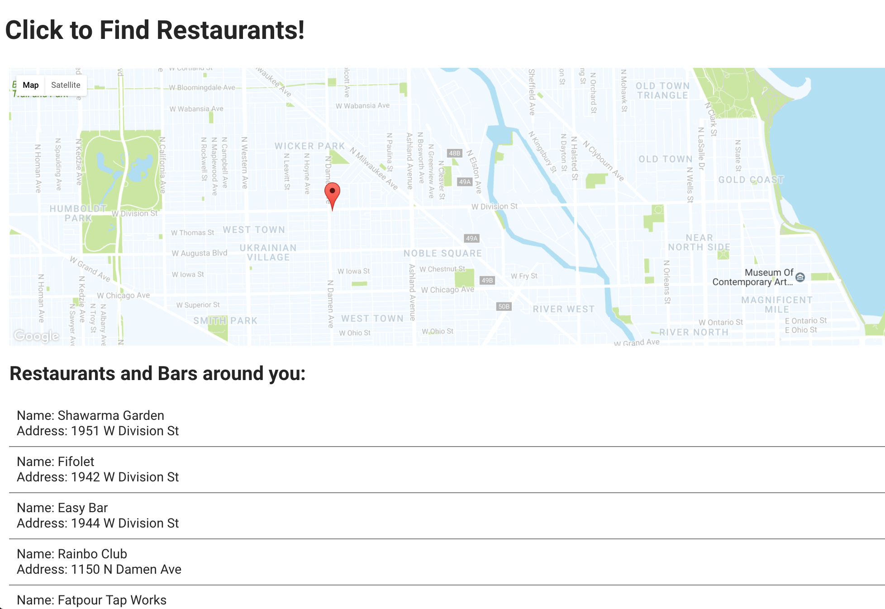

# Restaurant Finder

Simple app that lets you find restaurants and bars in your vicinity using the [Google Maps](https://developers.google.com/maps/) and [Foursquare](https://developer.foursquare.com/) APIs.

To run this app locally, you will need API keys from Google Maps and Foursquare. Store these keys in your `.env` file, at the app's root level.

Run `bundle` to get the gems necessary to run the application, and `rails s` to start your local server.

## Reflections

I originally intended to mash up Google Maps with Instagram, and return pictures tagged with a specific hashtag (#cats) taken in the vicinity of a pin on a map, but I ran into trouble with Instagram's OAuth and CORS. I spent some time trying to work through the issue, but eventually I chose to pivot and use Foursquare, which turned out to be a much easier API for me to access.

In its current state, I realize that using Rails is a bit of an overkill for this project. The original idea (#catstagram) would have stored the image urls in a database and allowed users to access previous search results, which is why I chose to use Rails originally. After pivoting to Foursquare, I decided not to spend time restructuring my project directories just for the sake of turning the project into a more basic Javascript and HTML/CSS structure.

I found it interesting to contrast the ease of implementation of Foursquare's API endpoints with the difficulty I experienced with Instagram's. I've experienced different levels of difficulty with API endpoint access before, and I'd like to think I gain something each time I do, although unfortunately, due to time constraints, I didn't get the satisfaction of working through my issues with Instagram. I plan to come back to it in the future!

### High Voltage Gem
I used Thoughtbot's [High Voltage](https://github.com/thoughtbot/high_voltage) gem to render the static homepage. Although the small scale of this project doesn't really showcase the benefits of this gem particularly well, it was nice to get a little experience with its routing syntax.

Thank you for the opportunity to demonstrate my work with this project! I'm looking forward to discussing it with your team!

